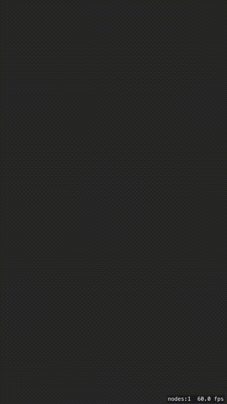

SpriteKit Smooth Sketch
 

===============

This project minimizes lag with free hand drawing SpriteKit apps by optimizing to decrease the number of nodes that are drawn on the screen from finger movement and eliminating the use of SKShapeNodes to output the lines. It uses bezier curves to calculate the movement of your sketch lines to produce the streaks that follow your finger.

1. [Inspiration](#inspiration)
1. [Demo](#demo)

# Inspiration

Freehand drawing is surprisingly difficult to implement properly on SpriteKit. That's because SKShapeNode is currently plagued with memory leaking bugs, meaning your overall game performance will degrade exponentially as the user continues drawing, until their device inevitably crashes.

I came across this issue when developing my [Traffic Pal](https://itunes.apple.com/ca/app/traffic-pal/id1265505042?mt=8) app for iOS, which required free hand drawing. After developing this framework to maximize freehand drawing performance in my app, I decided to open source my work so that nobody has to spend countless hours researching and optimizing freehand drawing anymore.

# Demo

